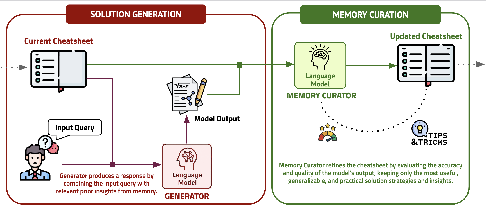
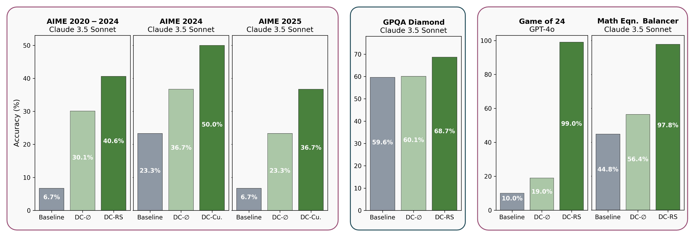

# Dynamic Cheatsheet: Test-Time Learning with Adaptive Memory

[](https://arxiv.org/abs/2504.07952) [](https://arxiv.org/abs/2504.07952)



## Dynamic Cheatsheet

A lightweight framework that gives language models (LMs) a persistent, evolving memory during inference time.

### Overview

Dynamic Cheatsheet (DC) endows black-box language models with the ability to store and reuse insights across queries. Rather than repeatedly re-discovering solutions or making the same mistakes, DC enables models to accumulate and leverage strategies, code snippets, and problem-solving techniques without modifying the underlying model parameters.

### Key Features

* **Persistent Memory**: Allows LMs to build and reference a growing knowledge base during inference
* **Self-Curated Storage**: Automatically focuses on concise, transferable snippets rather than entire transcripts
* **Black-Box Compatible**: Works with any LM without requiring access to model parameters
* **Zero-Shot Learning**: Improves performance without ground-truth labels or human feedback
* **Experience-Driven Learning**: Bridges the gap between isolated inference events and cumulative learning

### Performance Improvements

* **Mathematics**: Claude 3.5 Sonnet's accuracy more than doubled on AIME math exams by retaining algebraic insights
* **Puzzles**: GPT-4o's success rate on Game of 24 increased from approximately 10% to 99% after discovering and reusing Python-based solutions
* **Arithmetic**: Near-perfect accuracy on tasks like balancing equations (compared to baseline ~50%)
* **Knowledge-Intensive Tasks**: 9% improvement on GPQA-Diamond and 8% boost on MMLU-Pro Engineering and Physics problems




### Why Use Dynamic Cheatsheet?

Unlike fine-tuning or static retrieval methods, DC adapts LMs' problem-solving skills on the fly, continuously refining responses and reducing routine errors. This approach mimics the cumulative, experience-driven learning characteristic of human cognition, allowing models to learn from their experiences during deployment.

## Quick Start

Getting started with Dynamic Cheatsheet is straightforward. The framework allows you to enhance language models with persistent memory capabilities across inference sessions.

### Basic Usage

```python
from dynamic_cheatsheet.language_model import LanguageModel

# Initialize a model wrapper
model = LanguageModel(
    model_name="openai/gpt-4o-2024-11-20"  # Supports various models including OpenAI, Anthropic, DeepSeek, Llama, Gemini, etc.
)

# You can define custom prompts or use our recommended ones
# Generator prompt instructs the model how to utilize the cheatsheet
with open("prompts/generator_prompt.txt", "r") as f:
    generator_prompt = f.read()

# Curator prompt guides the model in updating and maintaining the cheatsheet
with open("prompts/curator_prompt_for_dc_cumulative.txt", "r") as f:
    curator_prompt = f.read()

# Example input - Game of 24 puzzle
input_txt = "Let's play a game called 24. You'll be given four integers, and your objective is to use each number only once, combined with any of the four arithmetic operations (addition, subtraction, multiplication, and division) and parentheses, to achieve a total of 24. For example, if the input is 4, 7, 8, and 8, the output could be (7 - (8 / 8)) * 4 = 24. Please present a single expression that evaluates to 24. Question  #1: 5 6 6 8"

# Initialize an empty cheatsheet or provide an existing one
current_cheatsheet = "(empty)"  # Start with an empty cheatsheet for new sessions

# Generate a response using the Dynamic Cheatsheet approach
results_dict = model.advanced_generate(
    approach_name="DynamicCheatsheet_Cumulative",  # Options: "DynamicCheatsheet_Cumulative", "DynamicCheatsheet_RetrievalSynthesis"
    input_txt=input_txt,
    cheatsheet=current_cheatsheet,
    generator_template=generator_prompt,
    cheatsheet_template=curator_prompt
)

# Extract results
model_full_output = results_dict["final_output"]  # Complete model output
model_answer = results_dict["final_answer"]       # Extracted answer
new_cheatsheet = results_dict['final_cheatsheet'] # Updated cheatsheet for future queries

# The updated cheatsheet can be saved or passed to subsequent calls
print(f"Model Answer: {model_answer}")
print(f"Updated Cheatsheet: {new_cheatsheet}")
```

### Understanding DC Variants

We provide two main variants of Dynamic Cheatsheet:

1. **DC-Cumulative**: Maintains a growing cheatsheet that accumulates knowledge across all queries. Best for sequential problem-solving where insights build upon each other.

2. **DC-Retrieval & Synthesis**: Uses similarity-based retrieval to find relevant previous experiences, then synthesizes them into a custom cheatsheet for each query. Ideal for large-scale applications with diverse queries.

### Example Notebook

For a comprehensive demonstration of Dynamic Cheatsheet capabilities, please take a look at our `ExampleUsage.ipynb` notebook. This interactive guide illustrates how the cheatsheet evolves using a simple example.

### Reproducing Results

The following command demonstrates how to benchmark Dynamic Cheatsheet with Retrieval and Synthesis on the Game of 24 puzzle:

```bash
python run_benchmark.py --task "GameOf24" --approach "DynamicCheatsheet_RetrievalSynthesis" \
    --model_name "openai/gpt-4o-2024-11-20" \
    --additional_flag_for_save_path "DynamicCheatsheet_RetrievalSynthesis" \
    --save_directory "TEST_RESULTS" \
    --generator_prompt_path "prompts/generator_prompt.txt" \
    --cheatsheet_prompt_path "prompts/curator_prompt_for_dc_retrieval_synthesis.txt" \
    --max_n_samples 10
```

#### Key Parameters:

- `--task`: Specifies the benchmark task (options include: `GameOf24`, `AIME_2025`, `GPQA_Diamond`, `MathEquationBalancer`, *inter alia*).
- `--approach`: Selects which DC variant or generation baseline to use (options include: `DynamicCheatsheet_RetrievalSynthesis`, `DynamicCheatsheet_RetrievalSynthesis`, `Dynamic_Retrieval`, `FullHistoryAppending`, `default`).
- `--model_name`: Defines which LLM to use (supports many provider formats); we recommend using smaller and cheaper models (e.g., `openai/gpt-4o-mini`) for initial testing.
- `--max_n_samples`: Limits the number of examples to process (useful for testing).
- `--save_directory`: Where to store benchmark results and generated cheatsheets.
- `--generator_prompt_path` & `--cheatsheet_prompt_path`: Paths to custom prompt templates.

Additional options and customizations can be found in the codebase.

## Citation

If you make use of our results, codebase, or results in your research or applications, please cite our paper:

```bibtex
@article{suzgun2025_DynamicCheatsheet,
      title={Dynamic Cheatsheet: Test-Time Learning with Adaptive Memory}, 
      author={Mirac Suzgun and Mert Yuksekgonul and Federico Bianchi and Dan Jurafsky and James Zou},
      year={2025},
      eprint={2504.07952},
      archivePrefix={arXiv},
      primaryClass={cs.LG},
      url={https://arxiv.org/abs/2504.07952}, 
}
```

For more details about the methodology and experimental results, please refer to our paper. You are also more than welcome to reach out to us if you have any questions about our work.
